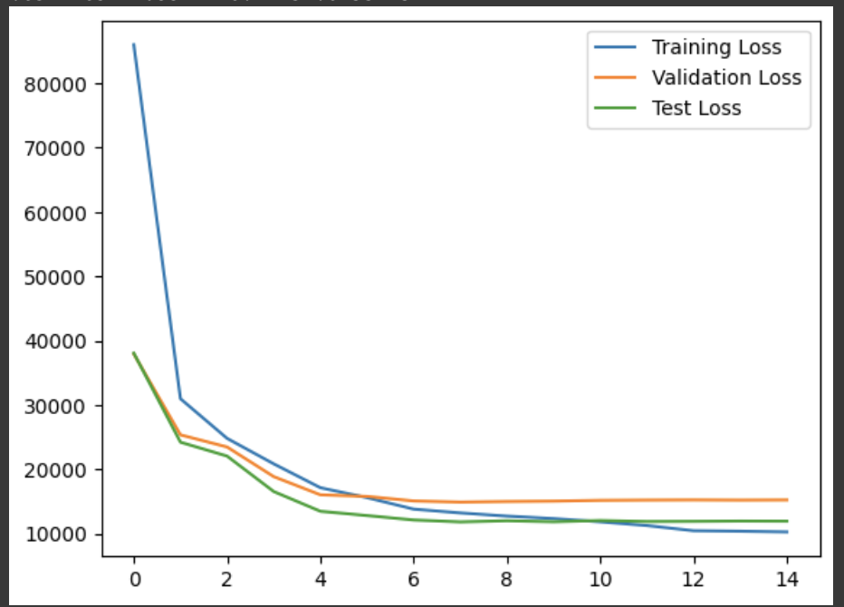
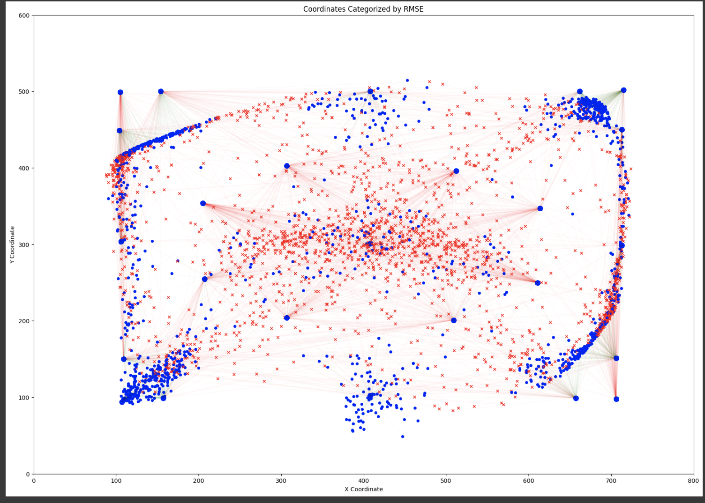
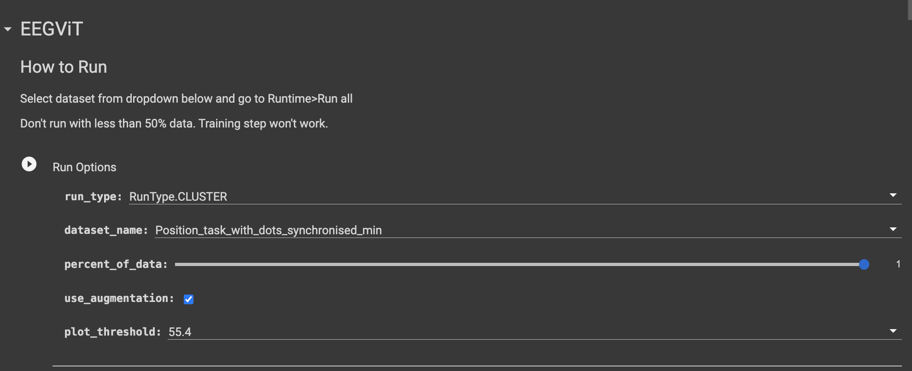

# EEG cLustered augmented vIsion Transformer (EEG-LiT)

## Prerequisites

1. **Google Colab Environment**: This script is designed to run in a Google Colab environment. 
2. **Google Drive Storage**: At least 10.40 GB of free space is needed in your Google Drive to store the dataset.
3. **Google Colab GPU**: A V100 GPU is recommended in Google Colab to reproduce the results accurately.

## Code Implementation Reference
The code implementation in this project includes references to the [EEGViT repository](https://github.com/ruiqiRichard/EEGViT). Specific portions of the code, as presented in the `EEG-LiT.ipynb` file, are based on or adapted from this repository.

## Installing Requirements

To set up the necessary environment for this project, run the following commands in your Python environment:

```bash
!pip install transformers
!pip install torch torchvision torchaudio --index-url https://download.pytorch.org/whl/cu117
!pip install pandas
!pip install numpy
!pip install scipy
!pip install tqdm
```

# Data Download Guide for EEGViT Dataset

This guide provides step-by-step instructions on how to download the EEGViT dataset in a Google Colab environment.


## Steps for Data Download

1. **Choose the Dataset**: 
   First, select the dataset you want to download. This can be done by setting the `dataset_name` variable. Available datasets include:
   - 'Position_task_with_dots_synchronised_min'
   - 'Position_task_with_dots_synchronised_max'
   - 'Position_task_with_dots_synchronised_min_hilbert'
   - 'LR_task_with_antisaccade_synchronised_min'

   Choose the following options:
   ```python
   dataset_name = 'Position_task_with_dots_synchronised_min'

2. **Mount Google Drive**:
   To store the dataset, mount your Google Drive in the Colab environment using the following commands:
   ```python
   from google.colab import drive
   drive.mount('/content/drive')

3. **Set File Directory**:
   Define the directory where the dataset will be stored. By default, it uses the EEGViT_DATA folder in your Google Drive:
   ```python
   file_dir = '/content/drive/MyDrive/EEGViT_DATA/'.

4. **Download the Dataset:**:
   The script checks if the dataset already exists in the specified directory. If not, it creates the directory and downloads the dataset.
   ```python
   
   import os
  
   if not os.path.exists(f'{file_dir}{dataset_name}.npz'):
     !mkdir -p {file_dir}
     !wget -P {file_dir} https://files.osf.io/v1/resources/ktv7m/providers/dropbox/prepared/{dataset_name}.npz

### Post-Download
After the download is complete, the dataset will be available in the specified `file_dir` on your Google Drive, ready for use in your projects.

## Results Overview
Training Results 



Visualization of Test Error



## Requirements
Google Colab

## How to Run
### Step 1 - Open EEG-LiT.ipynb in Google Collab

### Step 2 - Click Runtime > Run All
 

## Results

As illustrated in table 1, the pinnacle achievement on the EEGEyeNet dataset’s absolute position task prior to our re-sults was RMSE of **55.4 ± 0.2**

From our analysis, we observed a trend of decreasing RMSE values with advanced pre-training techniques using clustered and augmented data. The 'EEGVIT Pre-trained with Augmented Data' model demonstrated an RMSE of 54.95 mm, indicating the positive impact of data augmentation on model accuracy. Further enhancements in pre-training techniques are evident in the 'EEGVIT Pre-trained with Clustered Data' model, which achieved an RMSE of 52.98 mm.

The 'EEGVIT Pre-trained with Clustered and Augment Data' model, which combines both clustered and augmented data techniques in its pre-training, achieved an even lower RMSE of **52.24 mm**, reinforcing the efficacy of these combined strategies.

However, when scaling the model up to 'EEGVIT large Pre-trained with Clustered and Augment Data', the RMSE marginally increased to 52.28 mm. This suggests that while pre-training with clustered and augmented data does improve the model accuracy, the transition to a larger model variant does not necessarily confer a significant advantage in this context, and could indicate that the benefits of scaling up the model size have a threshold beyond which no substantial accuracy gains are observed.:

### [EEGEyeNet Absolute Position ](https://arxiv.org/abs/2111.05100)

| Model                                 | Absolute Position RMSE (mm) |
|---------------------------------------|-----------------------------|
| Naive Guessing                        | 123.3 ± 0.0                 |
| CNN                                   | 70.4 ± 1.1                  |
| PyramidalCNN                          | 73.9 ± 1.9                  |
| EEGNet                                | 81.3 ± 1.0                  |
| InceptionTime                         | 70.7 ± 0.8                  |
| Xception                              | 78.7 ± 1.6                  |
| VIT - Base                            | 61.5 ± 0.6                  |
| VIT - Base Pre-trained                | 58.1 ± 0.6                  |
| EEGVIT                                | 61.7 ± 0.6                  |
| EEGVIT Pre - trained                  | 55.4 ± 0.2                  |
| EEGVIT Pre - trained with Augmented Data | 54.95                     |
| EEGVIT Pre - trained with Clustered Data | 52.98                     |
| EEGVIT Pre - trained with Clustered and Augment Data | 52.24         |
| EEGVIT large Pre - trained with Clustered and Augment Data | 52.28   |


>📋  MIT License
