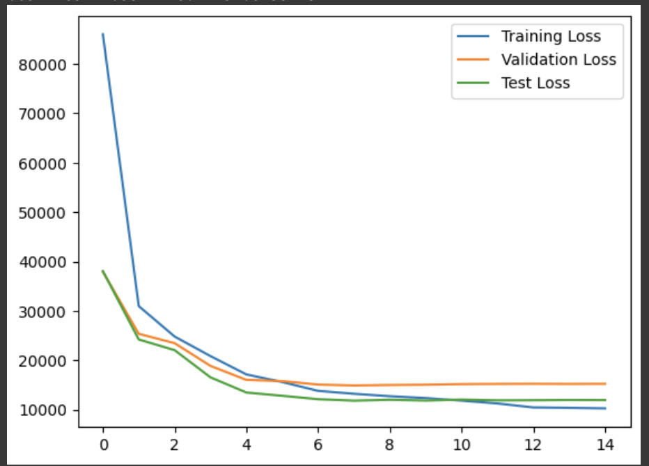
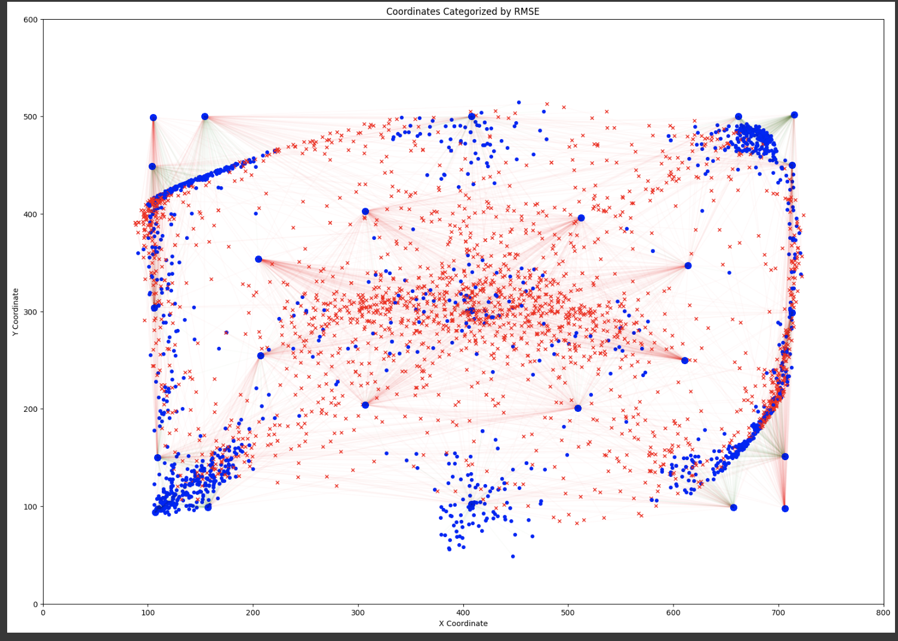
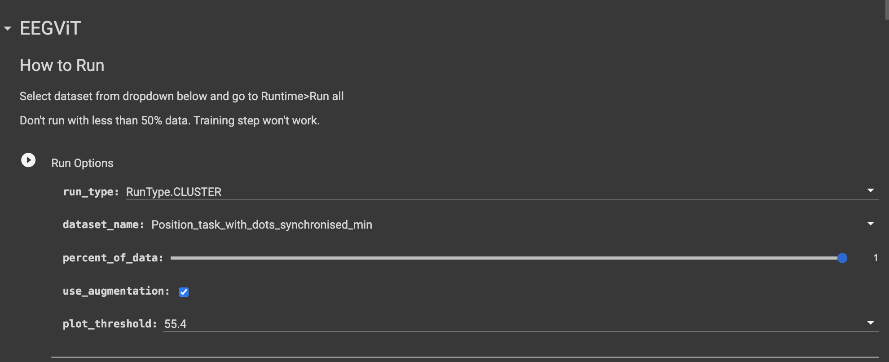

# EEG cLustered augmented vIsion Transformer (EEG-LiT)

## Prerequisites

1. **Google Colab Environment**: This script is designed to run in a Google Colab environment. 
2. **Google Drive Storage**: At least 10.40 GB of free space is needed in your Google Drive to store the dataset.
3. **Google Colab GPU**: A V100 GPU is recommended in Google Colab to reproduce the results accurately.

## Code Implementation Reference
The code implementation in this project includes references to the [EEGViT repository](https://github.com/ruiqiRichard/EEGViT). Specific portions of the code, as presented in the `EEG-LiT.ipynb` file, are based on or adapted from this repository.

## Installing Requirements

To set up the necessary environment for this project, run the following commands in your Python environment:

```bash
!pip install transformers
!pip install torch torchvision torchaudio --index-url https://download.pytorch.org/whl/cu117
!pip install pandas
!pip install numpy
!pip install scipy
!pip install tqdm
```

# Data Download Guide for EEGViT Dataset

This guide provides step-by-step instructions on how to download the EEGViT dataset in a Google Colab environment.


## Steps for Data Download

1. **Choose the Dataset**: 
   First, select the dataset you want to download. This can be done by setting the `dataset_name` variable. Available datasets include:
   - 'Position_task_with_dots_synchronised_min'
   - 'Position_task_with_dots_synchronised_max'
   - 'Position_task_with_dots_synchronised_min_hilbert'
   - 'LR_task_with_antisaccade_synchronised_min'

   Choose the following options:
   ```python
   dataset_name = 'Position_task_with_dots_synchronised_min'

2. **Mount Google Drive**:
   To store the dataset, mount your Google Drive in the Colab environment using the following commands:
   ```python
   from google.colab import drive
   drive.mount('/content/drive')

3. **Set File Directory**:
   Define the directory where the dataset will be stored. By default, it uses the EEGViT_DATA folder in your Google Drive:
   ```python
   file_dir = '/content/drive/MyDrive/EEGViT_DATA/'.

4. **Download the Dataset:**:
   The script checks if the dataset already exists in the specified directory. If not, it creates the directory and downloads the dataset.
   ```python
   
   import os
  
   if not os.path.exists(f'{file_dir}{dataset_name}.npz'):
     !mkdir -p {file_dir}
     !wget -P {file_dir} https://files.osf.io/v1/resources/ktv7m/providers/dropbox/prepared/{dataset_name}.npz

### Post-Download
After the download is complete, the dataset will be available in the specified `file_dir` on your Google Drive, ready for use in your projects.

## Results Overview
Training Results 



Visualization of Test Error



## Requirements
Google Colab

## How to Run
### Step 1 - Open EEG-LiT.ipynb in Google Collab

### Step 2 - Click Runtime > Run All
 

## Results

Our model achieves the following performance on :

### [EEGEyeNet Absolute Position ](https://arxiv.org/abs/2111.05100)

|      Model name    |       RMSE      | 
| ------------------ |---------------- | 
|       EEG-LiT      |       52.1      |


>📋  MIT License
